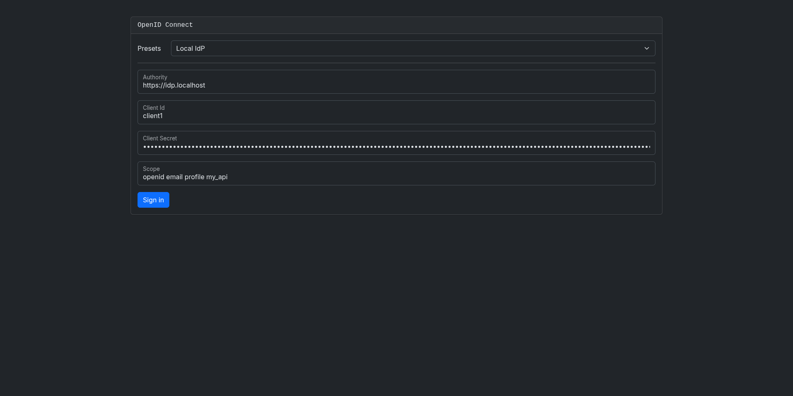
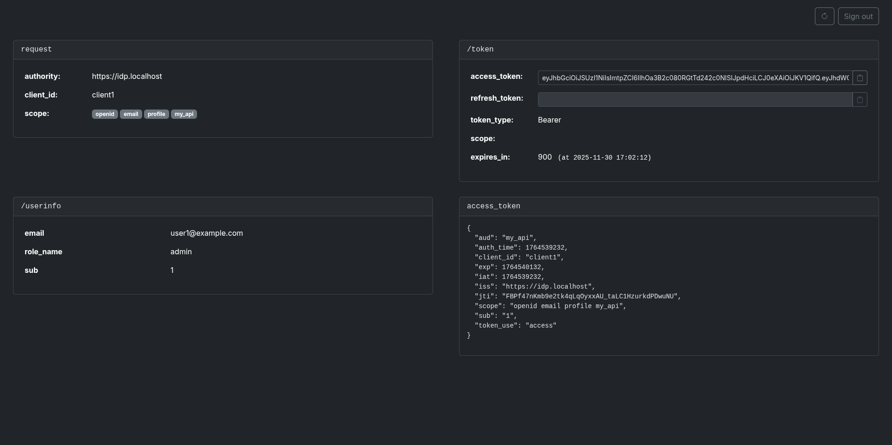

# OIDC Viewer: simple OIDC frontend

Simple OpenID Connect compatible token and claims viewer. Its goal is to make easy to validate STS servers configuration
and fetch an access token for any given scope. It only supports the authorization_code authentication with PKCE always 
enabled.

> ⚠ This should not be used on a publicly exposed server or as an OIDC sign-in connector. This is meant as a locally self-hosted tool for exploration or investigation.




# Features

- Supports the following authentication methods:
  - [x] `authorization_code` with Proof Key for Code Exchange (PKCE).
  - [ ] `client_credentials`

# Build

Build the Docker image using the following command:

```bash
dotnet publish --os linux --arch x64 /t:PublishContainer ./src
```

# Quick deployment guide

> This assumes that your are using the default settings provided in the repository.

- Build the image locally (see [Build](#Build)).

- Install root CA from [mkcert](https://github.com/FiloSottile/mkcert):

```shell
mkcert --install
```

- Create certificates using [mkcert](https://github.com/FiloSottile/mkcert):

```shell
mkcert --cert-file ./deploy/certs/localhost.crt \
       --key-file ./deploy/certs/localhost.key \ 
       localhost 127.0.0.1 ::1 "oidc.localhost"
```

- Copy `presets.env.sample` to `presets.env` and set your own presets.
- Run `docker compose up -d`
- Browse to https://oidc.localhost


# Custom usage

Simple docker-compose setup:

```dockerfile
services:
  oidc-viewer:
    image: mist-centauri/oidc-viewer:latest
    container_name: oidc-viewer
    restart: unless-stopped
    env_file: "presets.env"
    volumes:
      - aspnet_keys:/home/app/.aspnet/DataProtection-Keys
    ports:
      - "8080:8080"

volumes:
  aspnet_keys:
```

Using caddy as a reverse proxy:

- Caddyfile

```caddyfile
<name>.localhost {
  reverse_proxy oidc-viewer:8080
}
```

```dockerfile
services:
  caddy:
    image: docker.io/library/caddy:latest
    container_name: caddy
    restart: unless-stopped
    cap_add:
      - NET_ADMIN
    ports:
      - "80:80"
      - "443:443"
      - "443:443/udp"
    volumes:
      - ./Caddyfile:/etc/caddy/Caddyfile:ro
      - caddy_data:/data
      - caddy_config:/config

  oidc-viewer:
    image: mist-centauri/oidc-viewer:latest
    container_name: oidc-viewer
    restart: unless-stopped
    env_file: "presets.env"
    volumes:
      - aspnet_keys:/home/app/.aspnet/DataProtection-Keys
    ports:
      - "8080"

volumes:
  caddy_data:
  caddy_config:
  aspnet_keys:
```
